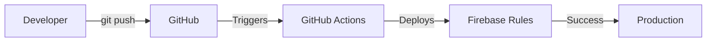

# 🔧 DevOps Setup Guide

Este documento contém as instruções para configurar a automação de deploy e garantir que a API do Stripe está segura.

## ✅ Configurações Implementadas

### 1. GitHub Actions Workflow
- **Arquivo:** `.github/workflows/firebase-deploy.yml`
- **Funcionalidade:** Deploy automático do `firestore.rules` quando o arquivo é alterado no branch `main` ou `master`
- **Status:** ✅ Criado

### 2. Firebase Configuration
- **Arquivo:** `firebase.json`
- **Status:** ✅ Criado
- **Conteúdo:** Configuração do Firestore Rules e hosting

### 3. Stripe API Security
- **Status:** ✅ Corrigido
- **Antes:** Lógica estava em `src/api/stripe-backend-example.ts` (exposta no frontend)
- **Depois:** API movida para `api/stripe/create-checkout.ts` (Vercel Serverless Function)
- **Arquivo inseguro:** ✅ Deletado

---

## 🔐 Configuração do GitHub Actions (REQUERIDA)

### Passo 1: Gerar Firebase Token

1. **Instale o Firebase CLI:**
   ```bash
   npm install -g firebase-tools
   ```

2. **Faça login no Firebase:**
   ```bash
   firebase login
   ```

3. **Gere um token de acesso:**
   ```bash
   firebase login:ci
   ```
   
   Isso vai gerar um token como: `1//0gxxxxx...`

### Passo 2: Adicionar Token no GitHub Secrets

1. **Acesse o repositório no GitHub:**
   - Vá para: `https://github.com/[seu-usuario]/[seu-repositorio]`

2. **Vá em Settings:**
   - Clique em **Settings** → **Secrets and variables** → **Actions**

3. **Adicione o Secret:**
   - Clique em **"New repository secret"**
   - **Name:** `FIREBASE_TOKEN`
   - **Value:** Cole o token gerado no passo anterior
   - Clique em **"Add secret"**

### Passo 3: Testar o Workflow

1. **Faça uma pequena alteração no `firestore.rules`:**
   ```bash
   git add firestore.rules
   git commit -m "test: trigger firebase deploy"
   git push origin main
   ```

2. **Verifique o deploy:**
   - Vá em **Actions** no GitHub
   - Clique no workflow mais recente
   - Verifique se o deploy foi bem-sucedido

---

## 🛡️ Verificação de Segurança da API Stripe

### Status Atual:
- ✅ API está em `api/stripe/create-checkout.ts` (raiz do projeto)
- ✅ Não está mais em `src/` (não será exposta no bundle)
- ✅ Usa variáveis de ambiente do Vercel
- ✅ Arquivo exemplo inseguro foi deletado

### Variáveis de Ambiente Necessárias (Vercel):

Certifique-se de que estas variáveis estão configuradas no Vercel Dashboard:

1. **STRIPE_SECRET_KEY** (obrigatório)
   - Sua chave secreta do Stripe
   - Formato: `sk_live_...` ou `sk_test_...`

2. **STRIPE_PRICE_ID** (obrigatório)
   - ID do preço da assinatura no Stripe
   - Formato: `price_...`

3. **STRIPE_COUPON_ID** (opcional)
   - ID do cupom de desconto (se usado)
   - Formato: `FIRST_MONTH_15` ou similar

4. **FIREBASE_SERVICE_ACCOUNT** (opcional)
   - JSON da service account do Firebase
   - Necessário para acesso ao Firestore no backend

### Como Configurar no Vercel:

1. Acesse: https://vercel.com/[seu-projeto]/settings/environment-variables

2. Adicione cada variável:
   - **Name:** Nome da variável
   - **Value:** Valor da variável
   - **Environment:** Selecione Production, Preview, Development

3. Clique em **"Save"**

---

## 📋 Checklist de Deploy

Antes de fazer deploy, verifique:

- [ ] Firebase token está configurado no GitHub Secrets
- [ ] `firestore.rules` existe na raiz do projeto
- [ ] `firebase.json` existe e está configurado corretamente
- [ ] Workflow do GitHub Actions está funcionando
- [ ] Variáveis de ambiente do Stripe estão configuradas no Vercel
- [ ] Arquivo `src/api/stripe-backend-example.ts` foi deletado
- [ ] API está em `api/stripe/create-checkout.ts`

---

## 🔄 Fluxo de Deploy Automático



1. **Developer faz alteração no `firestore.rules`**
2. **Commit e Push:**
   ```bash
   git add firestore.rules
   git commit -m "feat: update firestore rules"
   git push origin main
   ```
3. **GitHub Actions detecta a mudança**
4. **Workflow executa automaticamente**
5. **Firestore Rules são atualizados no Firebase**

---

## 🚨 Troubleshooting

### Workflow não executa
- **Problema:** Workflow não é acionado
- **Solução:** Verifique se o arquivo `firestore.rules` realmente foi alterado. O workflow só executa se o arquivo mudar.

### Erro: "FIREBASE_TOKEN not found"
- **Problema:** Token não está configurado
- **Solução:** Siga o Passo 2 acima para adicionar o secret no GitHub

### Erro: "Permission denied"
- **Problema:** Token não tem permissão
- **Solução:** Gere um novo token com `firebase login:ci` e atualize o secret

### API Stripe não funciona
- **Problema:** Erro 500 ou variáveis não encontradas
- **Solução:** 
  1. Verifique se as variáveis de ambiente estão configuradas no Vercel
  2. Verifique os logs do Vercel: https://vercel.com/[projeto]/functions
  3. Confirme que `STRIPE_SECRET_KEY` e `STRIPE_PRICE_ID` estão corretos

---

## 📝 Notas Importantes

- **Firebase Token:** O token gerado não expira automaticamente, mas você pode revogá-lo no Firebase Console
- **Vercel Functions:** As funções em `api/` são automaticamente detectadas pelo Vercel
- **Cache:** Após alterar variáveis de ambiente no Vercel, pode ser necessário fazer redeploy
- **Segurança:** Nunca commite tokens ou chaves secretas no repositório

---

**Última atualização:** Janeiro 2026
